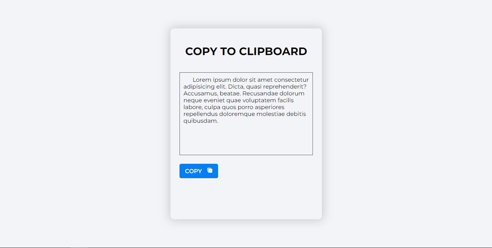

# Clipboard with Jquery

> this Jquery project is used to copy information from input.

## Built With

- HTML
- CSS
- JavaScript
- Jquery
## Live Demo

[Live Demo Link](https://lixyleon.github.io/clipboard_jquery_lixy_29jul23/)

## Getting Started
1. Clone this repo on your local machine

2. Open the index.html file in your browser.

3. Enjoy.

### Prerequisites
To make this repository working in your local machine you need only a browser.

## Author

👤 **Lixy León**

- Github: [@lixyleon](https://github.com/lixyleon)

## Show your support

Give a ⭐️ if you like this project!

## Acknowledgments

- Google: For letting us find crucial information in order to create this project.

## 📝 License

This project is [CC0-1.0](LICENSE) licensed.
